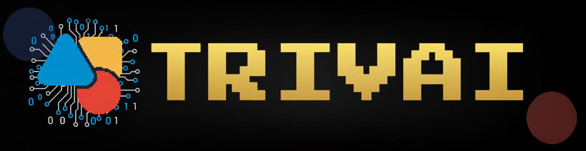

# TRIVAI - AI Based Game Platform

> Retro-inspired multi-game trivia platform where **agentic AI systems research, write, and polish every show**.



## Table of Contents

1. [What is TrivAI?](#what-is-trivai)
2. [How the Platform Works](#how-the-platform-works)
3. [Agentic AI Playbooks](#agentic-ai-playbooks)
4. [Setup & Configuration](#setup--configuration)
5. [Running Locally](#running-locally)
6. [Roadmap](#roadmap)
7. [License](#license)


---

## What is TrivAI?

TrivAI delivers an **arcade cabinet experience for trivia fans**. From the moment a player presses START, they enter:

- **Dynamic Jeopardy boards** built by cooperating AI agents that research categories, draft clues, and insert Daily Doubles.
- **Family Feud surveys** powered by synthetic respondents with unique personalities and biases.
- **Connections puzzles** curated by agents that craft conceptual links and difficulty tiers.

Every show is orchestrated by CrewAI agents (OpenAI + Serper) that plan, research, cross-check, and format data before it reaches the UI.

---

## How the Platform Works

1. **Player interacts with the cabinet UI** to choose a game, read the rules, and launch a session.
2. **Frontend requests a board**.
3. **Backend triggers an agent crew** (Jeopardy, Feud, or Connections) that:
   - Accepts player-selected theme/input.
   - Uses live search + AI to draft content.
   - Validates structure/output before responding.
4. **Backend normalizes the payload** (ensuring YAML/JSON compliance) and optionally persists snapshots for replay.
5. **Frontend animates the reveal** (CRT transitions, toasts, scoring), keeping all logic player-facing.

---

## Agentic AI Playbooks

### Jeopardy Board Factory

1. **Category Planner** ideates five themed categories in YAML, using Serper-powered research to avoid repetition.
2. **Question Crafter** escalates difficulty (200–1000), attaches optional images, and enforces Jeopardy phrasing.
3. **Game Assembler** validates format, injects Daily Doubles, and builds the board JSON required by frontend.

### Family Feud Simulator

1. **Personality Creator** drafts a diverse panel of virtual respondents (age, occupation, worldview).
2. **Survey Question Expert** writes five opinion-based prompts.
3. **Respondent Agents** answer each question in-character, feeding a **frequency aggregator** that ranks the top 10 answers.

### Connections Puzzle Builder

1. **Category Generator** outputs four categories, each tagged with difficulty.
2. **Item Curator** ensures every category has exactly four items that share a tight connection.
3. **Fallback logic** swaps in defaults if an AI response isn’t parseable.

---

## Setup & Configuration

### Prerequisites

- Node.js ≥ 18.18
- pnpm or npm
- Python ≥ 3.10 with `venv`
- OpenAI + Serper credentials

### Installation

```
git clone https://github.com/<your-username>/<repo>.git
cd <repo>
pnpm install
cd backend
python -m venv venv && source venv/bin/activate
pip install -r requirements.txt
cd ..
```

### Environment Variables

```
cp .env.local.example .env.local
cp backend/.env.example backend/.env
```

- `NEXT_PUBLIC_API_URL` – frontend → backend bridge
- `GOOGLE_CLIENT_ID/SECRET` – OAuth plumbing
- `OPENAI_API_KEY`, `SERPER_API_KEY` – agent tooling
- `SECRET_KEY`, `DATABASE_URL` – backend security/state

Never commit real env files; rotate any leaked secrets.

---

## Running Locally

Terminal A – **Arcade Cabinet**

```
pnpm dev   # http://localhost:3000
```

Terminal B – **Game Director**

```
cd backend
source venv/bin/activate
uvicorn app.main:app --reload --port 8000
```

Set `NEXT_PUBLIC_API_URL=http://localhost:8000` (or whichever port you use).

---

## Deployment Notes

### Frontend
- Deployable to Vercel, Netlify, or any Node-compatible host.
- Remember to configure env vars in the hosting dashboard (`NEXT_PUBLIC_*`).

### Backend
- Use Uvicorn/Gunicorn for production (e.g., `uvicorn app.main:app --host 0.0.0.0 --port 8000`).
- Replace SQLite with Postgres (set `DATABASE_URL=postgresql+psycopg://...`).
- Configure HTTPS, CORS (`origins` list), and productionLogging as part of deployment pipeline.


### License 
MIT License 
 


Feel free to open GitHub issues for bugs/feature requests.
